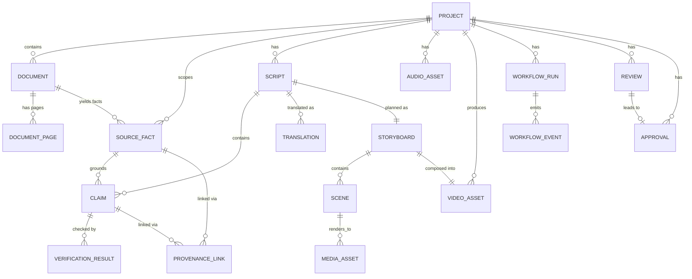

# VaaniReach — Data Model

All models live in [`core/models/`](../core/models/) as plain Pydantic
`BaseModel`s (see [`core/models/base.py`](../core/models/base.py)) —
framework-agnostic, importable by agents, the backend, or tests alike.
Every model inheriting `IdentifiedModel` carries `id`, `schema_version`
(starts at `1`, bump only on breaking field changes — no migration
tooling exists in Phase 0), and `created_at`.

## The source-of-truth chain

```
Document → SourceFact → Claim → VerificationResult → ProvenanceLink
```

- A `SourceFact` is the only place a fact may originate; it always carries
  a `SourceSpan` (document_id, page_number, text_span).
- A `Claim` cites one or more `source_fact_ids` — it is never itself
  authoritative.
- A `VerificationResult` classifies a claim `VERIFIED / CONTRADICTED /
  NOT_FOUND / UNCERTAIN` against the ledger, with `is_blocking` set when a
  `CRITICAL`-criticality claim isn't `VERIFIED`.
- A `ProvenanceLink` is the dashboard-facing join used for fact-level
  highlighting: claim → source fact → source span → verification status.

## Entity-relationship diagram



## Models

| Model | File | Key fields |
|---|---|---|
| `Project` | `project.py` | name, target_languages, status |
| `Document` | `document.py` | project_id, file_type, storage_path, checksum_sha256, ingestion_status |
| `DocumentPage` | `document.py` | document_id, page_number, raw_text, heading_texts, table_blocks |
| `SourceFact` | `fact.py` | project_id, document_id, fact_type, value, source_span, criticality, confidence |
| `Claim` | `claim.py` | project_id, claim_text, language, source_fact_ids, criticality |
| `Script` | `script.py` | project_id, language, narration_text, claim_ids, source_fact_ids, status |
| `Translation` | `translation.py` | project_id, script_id, language, translated_narration_text, status |
| `Storyboard` | `storyboard.py` | project_id, script_id, scene_ids, total_duration_seconds |
| `Scene` | `storyboard.py` | storyboard_id, order_index, scene_type, claim_ids, media_asset_ids |
| `MediaAsset` | `media.py` | project_id, scene_id, asset_type, provider_name, generation_status |
| `AudioAsset` | `media.py` | project_id, language, voice_id, tts_provider, generation_status |
| `VideoAsset` | `media.py` | project_id, storyboard_id, storage_path_mp4/srt/vtt, generation_status |
| `VerificationResult` | `verification.py` | claim_id, verification_type, status, matched_source_fact_ids, is_blocking |
| `WorkflowRun` | `workflow.py` | project_id, status, current_stage, event_ids |
| `WorkflowEvent` | `workflow.py` | workflow_run_id, stage, event_type, message, timestamp |
| `Review` | `review.py` | project_id, reviewer_id, comments, flagged_claim_ids |
| `Approval` | `review.py` | project_id, decision, decided_by, published |
| `SourceSpan` | `core/provenance/models.py` | document_id, page_number, text_span |
| `ProvenanceLink` | `core/provenance/models.py` | claim_id, source_fact_id, source_span, verification_status |

Fields are intentionally lean (MVP-sized). Anything not yet needed lives
in a generic `metadata: dict[str, Any]` field on most models rather than
being pre-guessed — extend individual models in Phase 1 as real usage
demands it, bumping `schema_version` if the change is breaking.
