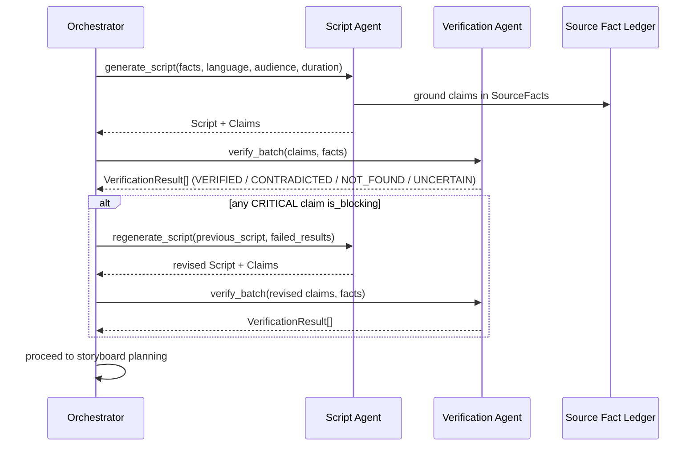

# VaaniReach — Workflow

> Phase 0: this describes the *intended* orchestration. No `WorkflowEngine`
> implementation exists yet — see [`core/interfaces/orchestrator.py`](../core/interfaces/orchestrator.py)
> for the contract Phase 1 will implement.

## Stage walk

| Stage | `PipelineStage` value | Primary agent |
|---|---|---|
| Document Ingestion | `document_ingestion` | Document Agent |
| Document Understanding | `document_understanding` | Document Agent |
| Fact Extraction | `fact_extraction` | Fact Extraction Agent |
| Script Generation | `script_generation` | Script Agent |
| Translation | `translation` | Translation Agent |
| Claim Extraction | `claim_extraction` | Script / Translation Agent |
| Verification | `verification` | Verification Agent |
| Storyboard Planning | `storyboard_planning` | Storyboard Agent |
| Media Generation | `media_generation` | Media Agent |
| Video Composition | `video_composition` | Media Agent |
| Final Verification | `final_verification` | Verification Agent |
| Human Review | `human_review` | (human) |
| Approval / Publication | `approval_publication` | (human) |

## Verify → regenerate loop



This loop repeats per target language — a Hindi script failing
verification does not block Marathi from proceeding independently.

## Execution trace (for the future dashboard)

Every stage transition emits a `WorkflowEvent` via
[`core/workflow/events.py`](../core/workflow/events.py). Example of the
kind of trace this produces (illustrative — no real run has happened yet):

```
10:31 Document processed
10:32 23 facts extracted
10:33 Hindi script generated
10:33 Hindi verification passed
10:34 Marathi script generated
10:34 Marathi verification failed
10:34 Regeneration triggered
10:35 Marathi verification passed
10:36 Video generation started
10:37 Awaiting human approval
```

`WorkflowEvent.message` is always a concise, operational, user-facing
string like the lines above — **never** raw model reasoning or
chain-of-thought.
